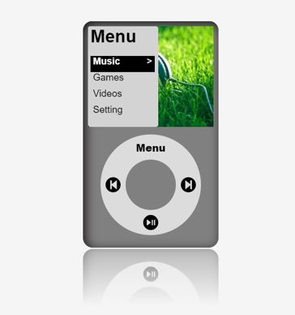

# Ipod-App
## Hosted at: https://amanrai24.github.io/iPod-App/

This project is an UI of an iPod.

This project was build using ReactJS.

This project use `ZingTouch` to move the mouse in a circular fashion and select Options.

## Functionality
* On clicking menu on circular wheel menu will be open.
* Click and Hold on the circular menu wheel and move in a circular fashion inside the menu boundary(Ehite circle) to navigate in the ipod menu.
* On clicking in the center wheel(grey circle) will select that menu.
* To go back click on the menu(white circle).

## Screenshot

## How to Use & Run
1. Clone the project or download the zip folder.
2. Go to the folder.
3. Run following command `npm install` to install require libaries.
4. Run command `npm start` to start the server.
5. Go to the `http://localhost:3000/`
6. Happy Learning.